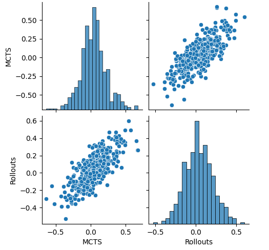

# Meta Tic Tac Toe

Meta Tic Tac Toe with Monte Carlo Tree Search (without neural networks).

```
+-1-2-3-+-4-5-6-+-7-8-9-+
1       | o o o |       |
2       | o o o |       |
3     o | o o o | o   o |
+-------+-------+-------+
4 x x x |     x |   x   |
5 x x x |   x   | x     |
6 x x x |     o |       |
+-------+-------+-------+
7 x     |   o   | . x x |
8   o   |       | . . . |
9       |       | . . . |
+-------+-------+-------+
        x to move
        
Choose your move!
> 77
```

This graphic analyzes the winning prediction (probability) of the first player dependent on their first move.<br>
<br>
The central sub-board is evidently the preferred choice. The central square within both the central and corner sub-boards has the highest probability of winning.<br>
However, in the edge sub-boards, the preference shifts to the edge squares. Even the least favorable move still provides a winning chance of more than 50%.<br><br>

Rollouts play an important role in the Monte Carlo Tree Search Algorithm, particularly when not a neural network isn't used. When reaching a leaf node at the constructed tree, a game is played to the end by rolling it out using random moves. This heuristic gives a hint which player is likely to win the game from the specific leaf node position of the game.<br>
<br>
The graph illustrates the correlation between the rolled out winnings chances and the actual value *Q* of a position.