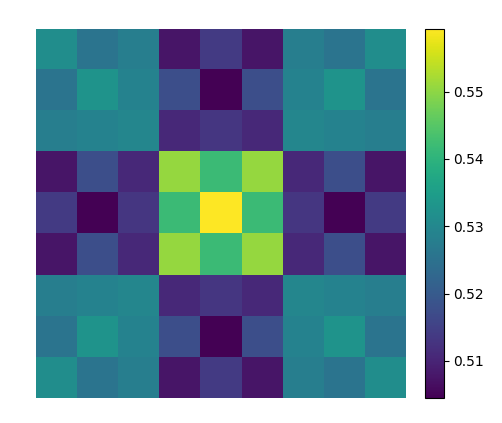

# Meta Tic Tac Toe

Meta Tic Tac Toe with Monte Carlo Tree Search (without neural networks).

```
+-1-2-3-+-4-5-6-+-7-8-9-+
1       | o o o |       |
2       | o o o |       |
3     o | o o o | o   o |
+-------+-------+-------+
4 x x x |     x |   x   |
5 x x x |   x   | x     |
6 x x x |     o |       |
+-------+-------+-------+
7 x     |   o   | . x x |
8   o   |       | . . . |
9       |       | . . . |
+-------+-------+-------+
        x to move
        
Choose your move!
> 77
```

This graphic analyzes the winning prediction (probability) of the first player dependent on their first move.<br>
<br>
The center subboard is clearly to be favoured. The center square of the center and corner subboards has the highest winning probability,
but at the edge subboards the edge squares are to be favoured.
Even the worst move grants more a winnings chance of more than 50 %.